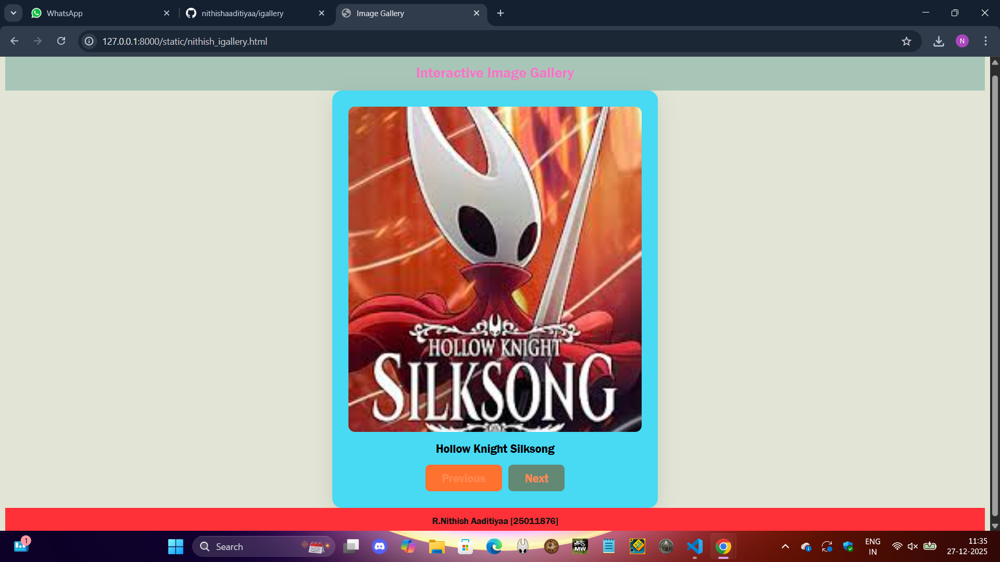
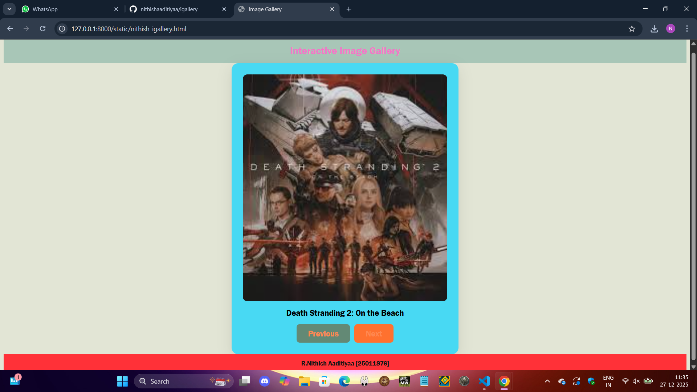
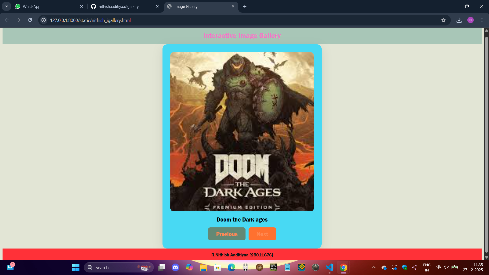
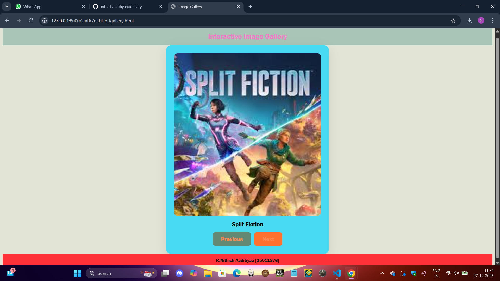
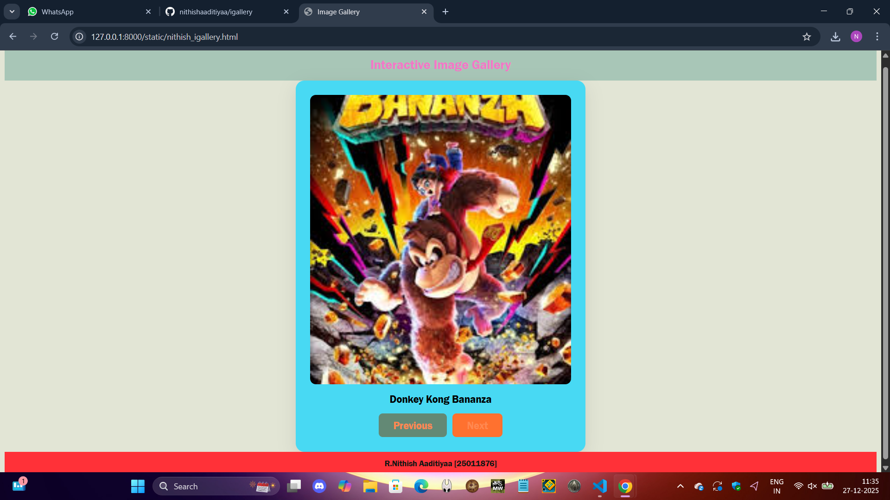
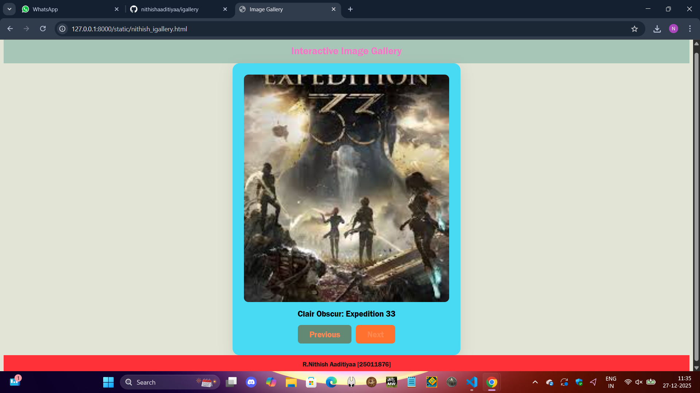

# Ex.07 Design of Interactive Image Gallery
## Date:

## AIM:
To design a web application for an inteactive image gallery for a minimum five images with next and previous buttons.

## DESIGN STEPS:

### Step 1:
Clone the github repository and create Django admin interface.

### Step 2:
Change settings.py file to allow request from all hosts.

### Step 3:
Use CSS for positioning and styling.

### Step 4:
Write JavaScript program for implementing interactivity.

### Step 5:
Validate the HTML and CSS code.

### Step 6:
Publish the website in the given URL.

## PROGRAM:
```
nithish_igallery.html

<html>
<head>
    <title>Image Gallery</title>
    <link href="style.css" rel="stylesheet" type="text/css">
</head>
<body>

    <div class="top-banner">Interactive Image Gallery</div>

    <div class="main-content">
        <div class="gallery-container">
            
            <div id="caption" class="caption"></div>
            <div class="gallery-buttons">
                <button onclick="prevImage()">Previous</button>
                <button onclick="nextImage()">Next</button>
            </div>
        </div>
    </div>

    <div class="footer-banner">
        R.Nithish Aaditiyaa [25011876]
    </div>

    <script src="script.js"></script>
</body>
</html>

script.js

const gallery = [
    { src: "1.jpg", caption: "Clair Obscur: Expedition 33" },
    { src: "2.jpg", caption: "Hollow Knight Silksong" },
    { src: "3.jpg", caption: "Death Stranding 2: On the Beach" },
    { src: "4.jpg", caption: "Doom the Dark ages" },
    { src: "5.jpg",caption:"Split Fiction"},
    { src: "6.jpg",caption:"Donkey Kong Bananza"},
];

let index = 0;

function updateGallery() {
    document.getElementById("galleryImage").src = gallery[index].src;
    document.getElementById("caption").textContent = gallery[index].caption;
}

function nextImage() {
    index++;
    if (index >= gallery.length) {
        index = 0;
    }
    updateGallery();
}

function prevImage() {
    index--;
    if (index < 0) {
        index = gallery.length - 1;
    }
    updateGallery();
}

style.css

body {
    font-family:'Franklin Gothic Medium', 'Arial Narrow', Arial, sans-serif;
    display: flex;
    flex-direction: column;
    height: 100vh;
    background-color: #e2e5d5;
}

.top-banner {
    background-color: #a8c6b7;
    color: rgb(241, 120, 199);
    text-align: center;
    padding: 15px;
    font-size: 22px;
    font-weight: bold;
}

.main-content {
    flex: 1;
    display: flex;
    justify-content: center;
    align-items: center;
}

.gallery-container {
    background: rgb(72, 217, 243);
    padding: 25px;
    border-radius: 15px;
    box-shadow: 0 10px 30px rgba(0, 0, 0, 0.1);
    text-align: center;
    width: 450px;
}

.gallery-image {
    width: 100%;
    height: 500px;
    object-fit: cover;
    border-radius: 10px;
}

.caption {
    margin: 15px 0;
    font-size: 18px;
    font-weight: 500;
}

.gallery-buttons {
    display: flex;
    justify-content: center;
    gap: 10px;
}

button {
    font-family: 'Franklin Gothic Medium', 'Arial Narrow', Arial, sans-serif;
    padding: 10px 25px;
    cursor: pointer;
    border: none;
    border-radius: 7px;
    background-color: #638975;
    color: rgb(255, 136, 81);
    font-size: 18px;
    transition: background 0.4s;
}

button:hover {
    background-color: #ff712f;
}

.footer-banner {
    background-color: #ff3138;
    color: rgb(15, 22, 19);
    text-align: center;
    padding: 12px;
    font-size: 14px;
}

```
## OUTPUT:






## RESULT:
The program for designing an interactive image gallery using HTML, CSS and JavaScript is executed successfully.
